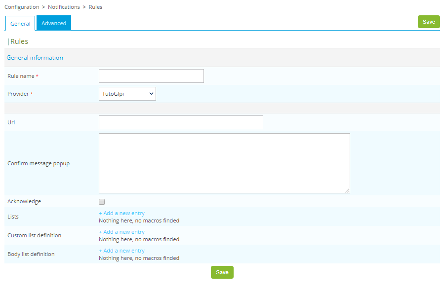
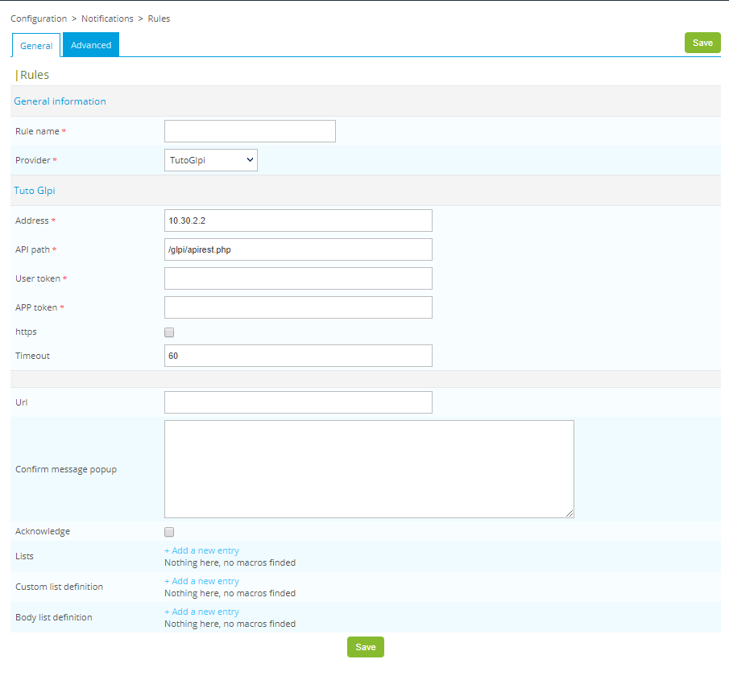
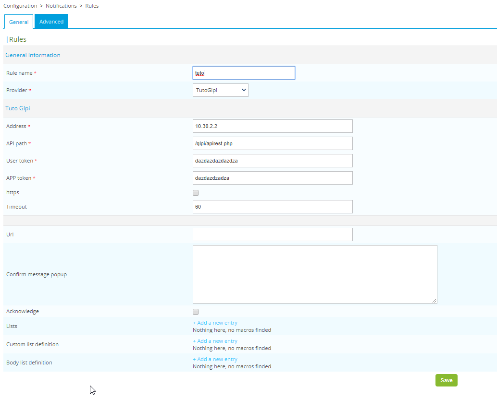
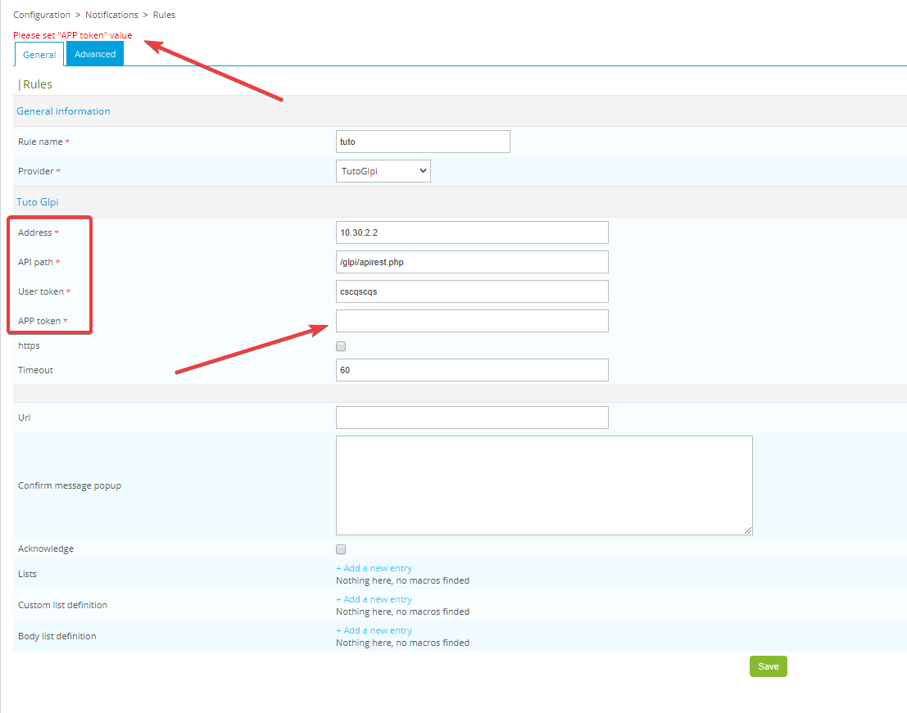

## INTRODUCTION
This documentation is here to help you go through the development of a Centreon open tickets provider.
We will use GLPI as an ITSM software and Centreon 19.10

## STARTING OUR PROJECT

- first of all, you need to register your provider.

`cat /usr/share/centreon/www/modules/centreon-open-tickets/providers/register.php`

```php
<?php
/*
 * Copyright 2015-2019 Centreon (http://www.centreon.com/)
 *
 * Centreon is a full-fledged industry-strength solution that meets
 * the needs in IT infrastructure and application monitoring for
 * service performance.
 *
 * Licensed under the Apache License, Version 2.0 (the "License");
 * you may not use this file except in compliance with the License.
 * You may obtain a copy of the License at
 *
 *    http://www.apache.org/licenses/LICENSE-2.0
 *
 * Unless required by applicable law or agreed to in writing, software
 * distributed under the License is distributed on an "AS IS" BASIS,*
 * WITHOUT WARRANTIES OR CONDITIONS OF ANY KIND, either express or implied.
 * See the License for the specific language governing permissions and
 * limitations under the License.
 */

$register_providers = array();

// provider name and the ID. For specific use id > 1000.
$register_providers['Mail'] = 1;
$register_providers['Glpi'] = 2;
$register_providers['Otrs'] = 3;
$register_providers['Simple'] = 4;
$register_providers['BmcItsm'] = 5;
$register_providers['Serena'] = 6;
$register_providers['BmcFootprints11'] = 7;
$register_providers['Easyvista'] = 8;
$register_providers['ServiceNow'] = 9;
$register_providers['Jira'] = 10;

// our custom provider
$register_providers['TutoGlpi'] = 2712;
```

This step is easy, you register your provider, its name is going to be **TutoGlpi**. Its id is going to be **2712**.
This ID is just used by centreon open ticket internally and won't be used in our provider itself.

- then you need to create the appropriate directory for your provider and your main provider code file.

`mkdir /usr/share/centreon/www/modules/centreon-open-tickets/providers/TutoGlpi`

`touch /usr/share/centreon/www/modules/centreon-open-tickets/providers/TutoGlpi/TutoGlpiProvider.class.php`

## CREATE YOUR CODE STRUCTURE

- open the TutoGlpiProvider.class.php file and start improvising

`vim /usr/share/centreon/www/modules/centreon-open-tickets/providers/TutoGlpi/TutoGlpiProvider.class.php`
```php
<?php
/*
 * Copyright 2019 Centreon (http://www.centreon.com/)
 *
 * Centreon is a full-fledged industry-strength solution that meets
 * the needs in IT infrastructure and application monitoring for
 * service performance.
 *
 * Licensed under the Apache License, Version 2.0 (the "License");
 * you may not use this file except in compliance with the License.
 * You may obtain a copy of the License at
 *
 *    http://www.apache.org/licenses/LICENSE-2.0
 *
 * Unless required by applicable law or agreed to in writing, software
 * distributed under the License is distributed on an "AS IS" BASIS,*
 * WITHOUT WARRANTIES OR CONDITIONS OF ANY KIND, either express or implied.
 * See the License for the specific language governing permissions and
 * limitations under the License.
 */

 class TutoGlpiProvider extends AbstractProvider {

   protected function _setDefaultValueExtra() {

   }

   protected function _setDefaultValueMain($body_html = 0) {

   }

   protected function _checkConfigForm() {

   }

   protected function _getConfigContainer1Extra() {

   }

   protected function _getConfigContainer2Extra() {

   }

   protected function saveConfigExtra() {

   }

   protected function getGroupListOptions() {

   }

   protected function assignOthers($entry, &$groups_order, &$groups) {

   }

   public function validateFormatPopup() {

   }

   protected function assignSubmittedValueSelectMore($select_input_id, $selected_id) {

   }

   protected function doSubmit($db_storage, $contact, $host_problems, $service_problems, $extra_ticket_arguments=array()) {

   }

 }
```

At this step, you should have the following result in the Configuration -> Notifications -> Rules menu


*note that at this point, you shouldn't have any PHP Notice nor any Error in your logfile
(/var/opt/rh/rh-php72/log/php-fpm/centreon-error.log)*

### PROVIDER RULE'S FORM
In this chapter, step by step, we're going to enhance the form that we've initiated.

#### Default options
First of all, we need to let people fill the default options to reach the Glpi REST API.
What we need is:
- an address for the Glpi server
- a path for its REST API
- a user token
- an app token
- should we use HTTPS ?
- a connection timeout

So lets get started and hope for the best.

```php
/*
* Set default values for our rule form options
* @return void
*/
protected function _setDefaultValueExtra() {
  $this->default_data['address'] = '10.30.2.2';
  $this->default_data['api_path'] = '/glpi/apirest.php';
  $this->default_data['user_token'] = '';
  $this->default_data['app_token'] = '';
  $this->default_data['https'] = 0;
  $this->default_data['timeout'] = 60;
}
```

By now, this change has done nothing, because Centreon is using Smarty as a template engine. We need to configure
that in order to have our form displayed on the web interface.

#### Displaying our default options
In order to get a better understanding of what we're doing, we are going to quickly initiate our template engine Smarty

```php
/*
* Initiate your html configuration and let Smarty display it in the rule form
*
* @return void
*/
protected function _getConfigContainer1Extra() {
  // initiate smarty and a few variables.
  $tpl = new Smarty();
  $tpl = initSmartyTplForPopup($this->_centreon_open_tickets_path, $tpl, 'providers/TutoGlpi/templates',
    $this->_centreon_path);
  $tpl->assign('_centreon_open_ticket_path', $this->_centreon_open_tickets_path);
  $tpl->assign('img_brick', './modules/centreon-open-tickets/images/brick.png');
  // Don't be afraid when you see _('Tuto Glpi'), that is just a short syntax for gettext. It is used to translate strings.
  $tpl->assign('header', array('TutoGlpi' => _("Tuto Glpi Configuration Part")));

  /*
  * we create the html that is going to be displayed
  */
  $address_html = '<input size="50" name="address" type="text" value="' . $this->_getFormValue('address') .'" />';
  $api_path_html = '<input size="50" name="api_path" type="text" value="' . $this->_getFormValue('api_path') . '" />';
  $user_token_html = '<input size="50" name="user_token" type="text" value="' . $this->_getFormValue('user_token') . '" autocomplete="off" />';
  $app_token_html = '<input size="50" name="app_token" type="text" value="' . $this->_getFormValue('app_token') . '" autocomplete="off" />';
  // will have the checked attribute, else, it won't, resulting in a ticked or unticked checkbox
  $https_html = '<input type=checkbox name="https" value="yes" ' . ($this->_getFormValue('https') == 'yes' ? 'checked' : '') . '/>';
  $timeout_html = '<input size="50" name="timeout" type="text" value="' . $this->_getFormValue('timeout') . '" :>';

  // this array is here to link a label with the html code that we've wrote above
  $array_form = array(
    'address' => array(
      'label' => _('Address'),
      'html' => $address_html
    ),
    'api_path' => array(
      'label' => _('API path'),
      'html' => $api_path_html
    ),
    'user_token' => array(
      'label' => _('User token'),
      'html' => $user_token_html
    ),
    'app_token' => array(
      'label' => _('APP token'),
      'html' => $app_token_html
    ),
    'https' => array(
      'label' => _('https'),
      'html' => $https_html
    ),
    'timeout' => array(
      'label' => _('Timeout'),
      'html' => $timeout_html
    )
  );

  $tpl->assign('form', $array_form);
  $this->_config['container1_html'] .= $tpl->fetch('conf_container1extra.ihtml');
}
```

Now that everything seems to be set up, we need to create our template file, the so called conf_container1extra.ihtml
- Create a template directory

`mkdir /usr/share/centreon/www/modules/centreon-open-tickets/providers/templates`

- Create your template file

`touch /usr/share/centreon/www/modules/centreon-open-tickets/providers/templates/conf_container1extra.ihtml`

write the following html code in your template file
```html
<tr class="list_lvl_1">
  <td class="ListColLvl1_name" colspan="2">
    <h4>{$header.TutoGlpi}</h4>
  </td>
</tr>
<tr class="list_one">
  <td class="FormRowField">
    {$form.address.label}
  </td>
  <td class="FormRowValue">
    {$form.address.html}
  </td>
</tr>
<tr class="list_one">
  <td class="FormRowField">
    {$form.api_path.label}
  </td>
  <td class="FormRowValue">
    {$form.api_path.html}
  </td>
</tr>
<tr class="list_one">
  <td class="FormRowField">
    {$form.user_token.label}
  </td>
  <td class="FormRowValue">
    {$form.user_token.html}
  </td>
</tr>
<tr class="list_one">
  <td class="FormRowField">
    {$form.app_token.label}
  </td>
  <td class="FormRowValue">
    {$form.app_token.html}
  </td>
</tr>
<tr class="list_one">
  <td class="FormRowField">
    {$form.https.label}
  </td>
  <td class="FormRowValue">
    {$form.https.html}
  </td>
</tr>
<tr class="list_one">
  <td class="FormRowField">
    {$form.timeout.label}
  </td>
  <td class="FormRowValue">
    {$form.timeout.html}
  </td>
</tr>
```

When done, you should have the following result and still no errors (or notices) in your log file



#### Saving our first rule

Now that we have a somewhat cool looking form, fill it with some random information like on the screenshot below



When done, just click the save button. You should be redirected to the rule menu and your rule should appear.
Click on it to edit its configuration.
If all went according to the plan, you've lost all your configuration (there's an easy broker configuration form joke to do there)
The reason is that, we've created the form, but never configured the save function. So here we go.

```php
/*
* Saves the rule form in the database
*
* @return void
*/
protected function saveConfigExtra() {
  $this->_save_config['simple']['address'] = $this->_submitted_config['address'];
  $this->_save_config['simple']['api_path'] = $this->_submitted_config['api_path'];
  $this->_save_config['simple']['user_token'] = $this->_submitted_config['user_token'];
  $this->_save_config['simple']['app_token'] = $this->_submitted_config['app_token'];
  $this->_save_config['simple']['https'] = $this->_submitted_config['https'];
  $this->_save_config['simple']['timeout'] = $this->_submitted_config['timeout'];
}
```

You've made it, now, if you delete your old failed rule, create a new one, fill our fields with random data and save the form.
It should be saved.

#### Control the saved data
What if I tell you that, you shouldn't let people save the form without having filled the mandatory fields that are:
- address
- API path
- User token
- App token

you should remember that we've made an array called `$array_form`. Now that we've listed the mandatory parameters, we're going
to edit their corresponding label by adding the `$this->_required_field` value. This just adds a small red star next to the label
so people know that it is mandatory.

```php
// this array is here to link a label with the html code that we've wrote above
$array_form = array(
  'address' => array(
    'label' => _('Address') . $this->_required_field,
    'html' => $address_html
  ),
  'api_path' => array(
    'label' => _('API path') . $this->_required_field,
    'html' => $api_path_html
  ),
  'user_token' => array(
    'label' => _('User token') . $this->_required_field,
    'html' => $user_token_html
  ),
  'app_token' => array(
    'label' => _('APP token') . $this->_required_field,
    'html' => $app_token_html
  ),
  'https' => array(
    'label' => _('https'),
    'html' => $https_html
  ),
  'timeout' => array(
    'label' => _('Timeout'),
    'html' => $timeout_html
  )
);
```

But people may be blind, so we need to add an extra layer of security

```php
  /*
  * Verify if every mandatory form field is filled with data
  *
  * @return void
  * @throw Exception
  */
  protected function _checkConfigForm() {
    $this->_check_error_message = '';
    $this->_check_error_message_append = '';

    $this->_checkFormValue('address', 'Please set "Address" value');
    $this->_checkFormValue('api_path', 'Please set "API path" value');
    $this->_checkFormValue('user_token', 'Please set "User token" value');
    $this->_checkFormValue('app_token', 'Please set "APP token" value');
    // you know what ? we're going to check if the timeout is an integer too
    $this->_checkFormInteger('timeout', '"Timeout" must be an integer');

    $this->_checkLists();

    if ($this->_check_error_message != '') {
      throw new Exception($this->_check_error_message);
    }
  }
```

We're done with this for the moment. Go try it out by removing the configuration of one of the mandatory fields and save the form
like on the screenshot below

