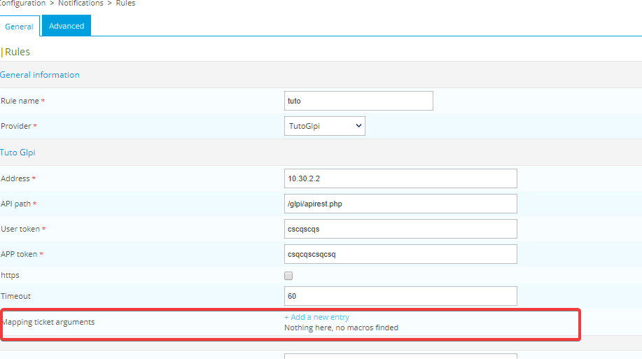
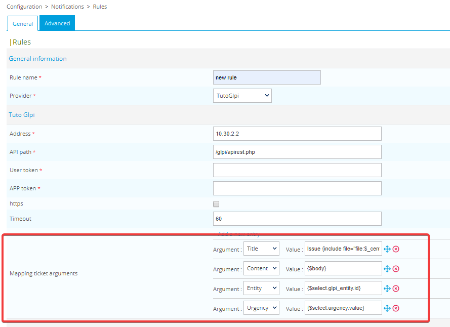
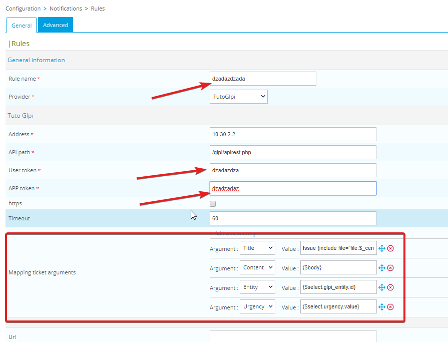
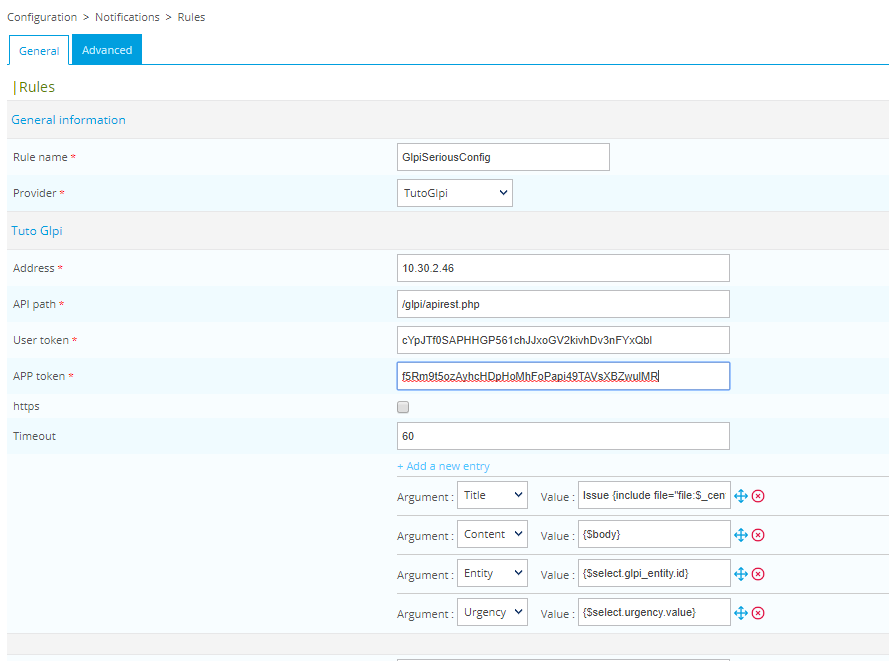
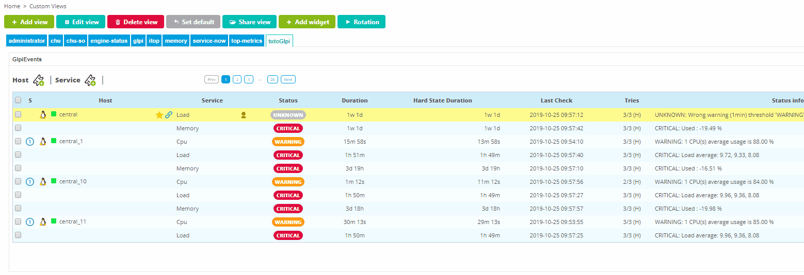

## Table of contents
1. [INTRODUCTION](#introduction)
2. [STARTING OUR PROJECT](#start-our-project)
3. [CREATE YOUR CODE STRUCTURE](#create-your-code-structure)
4. [FORM BASCICS](#form-basics)
    - [Default options](#default-options)
    - [Display our default options](#display-our-default-options)
    - [Save our first rule](#save-our-first-rule)
    - [Check the saved data](#check-the-saved-data)
5. [TICKET ARGUMENTS](#ticket-arguments)
    - [Arguments initialization](#arguments-initialization)
    - [Default ticket arguments options](#default-ticket-arguments-options)
    - [Display default ticket arguments](#display-default-ticket-arguments)
6. [PREPARING THE WIDGET](#preparing-the-widget)

## INTRODUCTION <a name="introduction"></a>
This documentation is here to help you go through the development of a Centreon open tickets provider.
We will use GLPI as an ITSM software and Centreon 19.10

## STARTING OUR PROJECT <a name="start-our-project"></a>

- first of all, you need to register your provider.

`cat /usr/share/centreon/www/modules/centreon-open-tickets/providers/register.php`

```php
/*
 * Copyright 2015-2019 Centreon (http://www.centreon.com/)
 *
 * Centreon is a full-fledged industry-strength solution that meets
 * the needs in IT infrastructure and application monitoring for
 * service performance.
 *
 * Licensed under the Apache License, Version 2.0 (the "License");
 * you may not use this file except in compliance with the License.
 * You may obtain a copy of the License at
 *
 *    http://www.apache.org/licenses/LICENSE-2.0
 *
 * Unless required by applicable law or agreed to in writing, software
 * distributed under the License is distributed on an "AS IS" BASIS,*
 * WITHOUT WARRANTIES OR CONDITIONS OF ANY KIND, either express or implied.
 * See the License for the specific language governing permissions and
 * limitations under the License.
 */

$register_providers = array();

// provider name and the ID. For specific use id > 1000.
$register_providers['Mail'] = 1;
$register_providers['Glpi'] = 2;
$register_providers['Otrs'] = 3;
$register_providers['Simple'] = 4;
$register_providers['BmcItsm'] = 5;
$register_providers['Serena'] = 6;
$register_providers['BmcFootprints11'] = 7;
$register_providers['Easyvista'] = 8;
$register_providers['ServiceNow'] = 9;
$register_providers['Jira'] = 10;

// our custom provider
$register_providers['TutoGlpi'] = 27121991;
```

This step is easy, you register your provider, its name is going to be **TutoGlpi**. Its id is going to be **27121991**.
This ID is just used by centreon open ticket internally and won't be used in our provider itself.

- then you need to create the appropriate directory for your provider and your main provider code file.

`mkdir /usr/share/centreon/www/modules/centreon-open-tickets/providers/TutoGlpi`

`touch /usr/share/centreon/www/modules/centreon-open-tickets/providers/TutoGlpi/TutoGlpiProvider.class.php`

## CREATE YOUR CODE STRUCTURE <a name="create-your-code-structure"></a>

- open the TutoGlpiProvider.class.php file and start improvising

`vim /usr/share/centreon/www/modules/centreon-open-tickets/providers/TutoGlpi/TutoGlpiProvider.class.php`
```php
/*
 * Copyright 2019 Centreon (http://www.centreon.com/)
 *
 * Centreon is a full-fledged industry-strength solution that meets
 * the needs in IT infrastructure and application monitoring for
 * service performance.
 *
 * Licensed under the Apache License, Version 2.0 (the "License");
 * you may not use this file except in compliance with the License.
 * You may obtain a copy of the License at
 *
 *    http://www.apache.org/licenses/LICENSE-2.0
 *
 * Unless required by applicable law or agreed to in writing, software
 * distributed under the License is distributed on an "AS IS" BASIS,*
 * WITHOUT WARRANTIES OR CONDITIONS OF ANY KIND, either express or implied.
 * See the License for the specific language governing permissions and
 * limitations under the License.
 */

 class TutoGlpiProvider extends AbstractProvider {

   protected function _setDefaultValueExtra() {

   }

   protected function _setDefaultValueMain($body_html = 0) {

   }

   protected function _checkConfigForm() {

   }

   protected function _getConfigContainer1Extra() {

   }

   protected function _getConfigContainer2Extra() {

   }

   protected function saveConfigExtra() {

   }

   protected function getGroupListOptions() {

   }

   protected function assignOthers($entry, &$groups_order, &$groups) {

   }

   public function validateFormatPopup() {

   }

   protected function assignSubmittedValueSelectMore($select_input_id, $selected_id) {

   }

   protected function doSubmit($db_storage, $contact, $host_problems, $service_problems, $extra_ticket_arguments=array()) {

   }

 }
```

At this step, you should have the following result in the Configuration -> Notifications -> Rules menu


*note that at this point, you shouldn't have any PHP Notice nor any Error in your logfile
(/var/opt/rh/rh-php72/log/php-fpm/centreon-error.log)*

## FORM BASICS <a name="form-basics"></a>  
In this chapter, step by step, we're going to enhance the form that we've initiated.

### Default options <a name="default-options"></a>
First of all, we need to let people fill the default options to reach the Glpi REST API.
What we need are:
- an address for the Glpi server
- a path for its REST API
- a user token
- an app token
- should we use HTTPS ?
- a connection timeout

So let's get started and hope for the best.

```php
/*
* Set default values for our rule form options
* @return void
*/
protected function _setDefaultValueExtra() {
  $this->default_data['address'] = '10.30.2.2';
  $this->default_data['api_path'] = '/glpi/apirest.php';
  $this->default_data['user_token'] = '';
  $this->default_data['app_token'] = '';
  $this->default_data['https'] = 0;
  $this->default_data['timeout'] = 60;
}
```

By now, this change has done nothing, because Centreon is using Smarty as a template engine. We need to configure
that in order to have our form displayed on the web interface.

### Display our default options <a name="display-our-default-options"></a>
In order to get a better understanding of what we're doing, we are going to quickly initiate our template engine Smarty

```php
/*
* Initiate your html configuration and let Smarty display it in the rule form
*
* @return void
*/
protected function _getConfigContainer1Extra() {
  // initiate smarty and a few variables.
  $tpl = new Smarty();
  $tpl = initSmartyTplForPopup($this->_centreon_open_tickets_path, $tpl, 'providers/TutoGlpi/templates',
    $this->_centreon_path);
  $tpl->assign('centreon_open_tickets_path', $this->_centreon_open_tickets_path);
  $tpl->assign('img_brick', './modules/centreon-open-tickets/images/brick.png');
  // Don't be afraid when you see _('Tuto Glpi'), that is just a short syntax for gettext. It is used to translate strings.
  $tpl->assign('header', array('TutoGlpi' => _("Tuto Glpi Configuration Part")));

  /*
  * we create the html that is going to be displayed
  */
  $address_html = '<input size="50" name="address" type="text" value="' . $this->_getFormValue('address') .'" />';
  $api_path_html = '<input size="50" name="api_path" type="text" value="' . $this->_getFormValue('api_path') . '" />';
  $user_token_html = '<input size="50" name="user_token" type="text" value="' . $this->_getFormValue('user_token') . '" autocomplete="off" />';
  $app_token_html = '<input size="50" name="app_token" type="text" value="' . $this->_getFormValue('app_token') . '" autocomplete="off" />';
  // for those who aren't familiar with ternary conditions, this means that if in the form, the value of https is equal to yes, then the input
  // will have the checked attribute, else, it won't, resulting in a ticked or unticked checkbox
  $https_html = '<input type=checkbox name="https" value="yes" ' . ($this->_getFormValue('https') == 'yes' ? 'checked' : '') . '/>';
  $timeout_html = '<input size="50" name="timeout" type="text" value="' . $this->_getFormValue('timeout') . '" :>';

  // this array is here to link a label with the html code that we've wrote above
  $array_form = array(
    'address' => array(
      'label' => _('Address'),
      'html' => $address_html
    ),
    'api_path' => array(
      'label' => _('API path'),
      'html' => $api_path_html
    ),
    'user_token' => array(
      'label' => _('User token'),
      'html' => $user_token_html
    ),
    'app_token' => array(
      'label' => _('APP token'),
      'html' => $app_token_html
    ),
    'https' => array(
      'label' => _('https'),
      'html' => $https_html
    ),
    'timeout' => array(
      'label' => _('Timeout'),
      'html' => $timeout_html
    )
  );

  $tpl->assign('form', $array_form);
  $this->_config['container1_html'] .= $tpl->fetch('conf_container1extra.ihtml');
}
```

Now that everything seems to be set up, we need to create our template file, the so called conf_container1extra.ihtml
- Create a template directory

`mkdir /usr/share/centreon/www/modules/centreon-open-tickets/providers/templates`

- Create your template file

`touch /usr/share/centreon/www/modules/centreon-open-tickets/providers/templates/conf_container1extra.ihtml`

write the following html code in your template file
```html
<tr class="list_lvl_1">
  <td class="ListColLvl1_name" colspan="2">
    <h4>{$header.TutoGlpi}</h4>
  </td>
</tr>
<tr class="list_one">
  <td class="FormRowField">
    {$form.address.label}
  </td>
  <td class="FormRowValue">
    {$form.address.html}
  </td>
</tr>
<tr class="list_two">
  <td class="FormRowField">
    {$form.api_path.label}
  </td>
  <td class="FormRowValue">
    {$form.api_path.html}
  </td>
</tr>
<tr class="list_one">
  <td class="FormRowField">
    {$form.user_token.label}
  </td>
  <td class="FormRowValue">
    {$form.user_token.html}
  </td>
</tr>
<tr class="list_two">
  <td class="FormRowField">
    {$form.app_token.label}
  </td>
  <td class="FormRowValue">
    {$form.app_token.html}
  </td>
</tr>
<tr class="list_one">
  <td class="FormRowField">
    {$form.https.label}
  </td>
  <td class="FormRowValue">
    {$form.https.html}
  </td>
</tr>
<tr class="list_two">
  <td class="FormRowField">
    {$form.timeout.label}
  </td>
  <td class="FormRowValue">
    {$form.timeout.html}
  </td>
</tr>
```

When done, you should have the following result and still no errors (or notices) in your log file


### Save our first rule <a name="save-our-first-rule"></a>

Now that we have a somewhat cool looking form, fill it with some random information like on the screenshot below


When done, just click the save button. You should be redirected to the rule menu and your rule should appear.
Click on it to edit its configuration.
If all went according to the plan, you've lost all your configuration (there's an easy broker configuration form joke to do there)
The reason is that, we've created the form, but never configured the save function. So here we go.

```php
/*
* Saves the rule form in the database
*
* @return void
*/
protected function saveConfigExtra() {
  $this->_save_config['simple']['address'] = $this->_submitted_config['address'];
  $this->_save_config['simple']['api_path'] = $this->_submitted_config['api_path'];
  $this->_save_config['simple']['user_token'] = $this->_submitted_config['user_token'];
  $this->_save_config['simple']['app_token'] = $this->_submitted_config['app_token'];
  $this->_save_config['simple']['https'] = $this->_submitted_config['https'];
  $this->_save_config['simple']['timeout'] = $this->_submitted_config['timeout'];
}
```

You've made it, now, if you delete your old failed rule, create a new one, fill our fields with random data and save the form.
It should be saved.

### Check the saved data <a name="check-the-saved-data"></a>
What if I tell you that, you shouldn't let people save the form without having filled the mandatory fields that are:
- address
- API path
- User token
- App token

you should remember that we've made an array called `$array_form`. Now that we've listed the mandatory parameters, we're going
to edit their corresponding label by adding the `$this->_required_field` value. This just adds a small red star next to the label
so people know that it is mandatory.

```php
// this array is here to link a label with the html code that we've wrote above
$array_form = array(
  'address' => array(
    'label' => _('Address') . $this->_required_field,
    'html' => $address_html
  ),
  'api_path' => array(
    'label' => _('API path') . $this->_required_field,
    'html' => $api_path_html
  ),
  'user_token' => array(
    'label' => _('User token') . $this->_required_field,
    'html' => $user_token_html
  ),
  'app_token' => array(
    'label' => _('APP token') . $this->_required_field,
    'html' => $app_token_html
  ),
  'https' => array(
    'label' => _('https'),
    'html' => $https_html
  ),
  'timeout' => array(
    'label' => _('Timeout'),
    'html' => $timeout_html
  )
);
```

But people may be blind, so we need to add an extra layer of security

```php
  /*
  * Verify if every mandatory form field is filled with data
  *
  * @return void
  * @throw Exception
  */
  protected function _checkConfigForm() {
    $this->_check_error_message = '';
    $this->_check_error_message_append = '';

    $this->_checkFormValue('address', 'Please set "Address" value');
    $this->_checkFormValue('api_path', 'Please set "API path" value');
    $this->_checkFormValue('user_token', 'Please set "User token" value');
    $this->_checkFormValue('app_token', 'Please set "APP token" value');
    // you know what ? we're going to check if the timeout is an integer too
    $this->_checkFormInteger('timeout', '"Timeout" must be an integer');

    $this->_checkLists();

    if ($this->_check_error_message != '') {
      throw new Exception($this->_check_error_message);
    }
  }
```

We're done with this for the moment. Go try it out by removing the configuration of one of the mandatory fields and save the form
like on the screenshot below


## TICKET ARGUMENTS <a name="ticket-arguments"></a>
Now is the time to start configuring our tickets arguments. We're going to start with a few parameters so everything
is understandable.
Here is the list of what we're going to configure:

- the body (content) of the ticket
- the subject of the ticket
- the entity linked to the ticket (this is a specific Glpi parameter)
- the urgency of the ticket (this is a specific Glpi parameter)

### Arguments initialization <a name="arguments-initialization"></a>
Let's jump back to the top of our class and initiate a few variables

```php
class TutoGlpiProvider extends AbstractProvider {

    const GLPI_ENTITIES_TYPE = 10;

    const ARG_CONTENT = 1;
    const ARG_ENTITY = 2;
    const ARG_URGENCY = 3;
    const ARG_TITLE = 4;

    protected $_internal_arg_name = array(
        self::ARG_CONTENT => 'content',
        self::ARG_ENTITY => 'entity',
        self::ARG_URGENCY => 'urgency',
        self::ARG_TITLE => 'title'
    );

    // ... code ... //
}
```

This is where things can be confusing for beginners. So we're going to add a bit of debug there.
We're going to put the debug inside the `_getConfigContainer1Extra()` function. So your function should look like that:

```php
 protected function _getConfigContainer1Extra() {
     $file = fopen("/var/opt/rh/rh-php72/log/php-fpm/tuto.log", "w") or die ("Unable to open file!");
     fwrite($file, print_r($this->_internal_arg_name,true));
     fclose($file);

     // ... code .... //
}
```

If you go on the rule form page, nothing should have changed but a new logfile should have appeared in
`/var/opt/rh/rh-php72/log/php-fpm/tuto.log`

```php
Array
(
    [1] => content
    [2] => entity
    [3] => urgency
    [4] => title
)
```
Now that you've seen the debug, we can remove the fopen, fwrite and fclose statement that we've added.

### Default ticket arguments options <a name="default-ticket-arguments-options"></a>
Like we did at the beginning, we need to let people configure those parameters

```php
/*
* Set default values for our rule form options
* @return void
*/
protected function _setDefaultValueExtra() {
  $this->default_data['address'] = '10.30.2.2';
  $this->default_data['api_path'] = '/glpi/apirest.php';
  $this->default_data['user_token'] = '';
  $this->default_data['app_token'] = '';
  $this->default_data['https'] = 0;
  $this->default_data['timeout'] = 60;

  $this->default_data['clones']['mappingTicket'] = array(
    array(
      'Arg' =>  self::ARG_TITLE,
      'Value' => 'Issue {include file="file:$_centreon_open_tickets_path/providers/Abstract/templates/display_title.ihtml"}'
    ),
    array(
      'Arg' => self::ARG_CONTENT,
      'Value' => '{$body}'
    ),
    array(
      'Arg' => self::ARG_ENTITY,
      'Value' => '{$select.glpi_entity.id}'
    ),
    array(
      'Arg' => self::ARG_URGENCY,
      'Value' => '{$select.urgency.value}'
    )
  );
}
```

### Display default ticket arguments <a name="display-default-ticket-arguments"></a>
We are going to face the same issue than before, nothing is going to be displayed on our webinterface if
we don't link it to our template one way or another.

```php
/*
* Initiate your html configuration and let Smarty display it in the rule form
*
* @return void
*/
protected function _getConfigContainer1Extra() {

  // ... code ... //

  $array_form = array(
    'address' => array(
      'label' => _('Address'),
      'html' => $address_html
    ),
    'api_path' => array(
      'label' => _('API path'),
      'html' => $api_path_html
    ),
    'user_token' => array(
      'label' => _('User token'),
      'html' => $user_token_html
    ),
    'app_token' => array(
      'label' => _('APP token'),
      'html' => $app_token_html
    ),
    'https' => array(
      'label' => _('https'),
      'html' => $https_html
    ),
    'timeout' => array(
      'label' => _('Timeout'),
      'html' => $timeout_html
    ),
    //we add a key to our array
    'mappingTicket' => array(
      'label' => _('Mapping ticket arguments')
    )
  );

  // html
  $mappingTicketValue_html = '<input id="mappingTicketValue_#index#" name="mappingTicketValue[#index#]" size="20" type="text"';

  // html code for a dropdown list where we will be able to select something from the following list
  $mappingTicketArg_html = '<select id="mappingTicketArg_#index#" name="mappingTicketArg[#index#]" type="select-one">' .
    '<option value="' . self::ARG_TITLE . '">' . _("Title") . '</option>' .
    '<option value="' . self::ARG_CONTENT . '">' . _("Content") . '</option>' .
    '<option value="' . self::ARG_ENTITY . '">' . _("Entity") . '</option>' .
    '<option value="' . self::ARG_URGENCY . '">' . _("Urgency") . '</option>' .  
  '</select>';

  // we asociate the label with the html code but for the arguments that we've been working on lately
  $array_form['mappingTicket'] = array(
    array(
      'label' => _('Argument'),
      'html' => $mappingTicketArg_html
    ),
    array(
      'label' => _('Value'),
      'html' => $mappingTicketValue_html
    )
  );

  $tpl->assign('form', $array_form);
  $this->_config['container1_html'] .= $tpl->fetch('conf_container1extra.ihtml');
  $this->_config['clones']['mappingTicket'] = $this->_getCloneValue('mappingTicket');
}
```

Now that our html is ready, we need to adapt our template file `conf_container1extra.ihtml`
add the end of this file add:

```html

<!-- ... code ... -->

<tr class="list_one">
    <td class="FormRowField">
        {$form.mappingTicket.label}
    </td>
    <td class="FormRowValue">
        {include file="file:$centreon_open_tickets_path/providers/Abstract/templates/clone.ihtml" cloneId="mappingTicket" cloneSet=$form.mappingTicket}
    </td>
</tr>
```

We're good now, let's take a look at our work. Go back to your rule form and check what happened.



That's a bit disapointing, all that code, just to get a text, a small button and a grammar mistake (if you look closely, you'll be able to *find* it)

Well in fact, if we click on **Add a new entry** we can see a part of our work.
By clicking on it, you should be able to understand the naming of what we worked on:

`$this->default_data['clones']['mappingTicket']`

we are cloning elements and by doing it, we want to map a ticket argument (content, title, entity or urgency) with a value.

To have a better overview of that, just go back to the rule menu, create a new rule, select TutoGlpi as a rule, and you'll each ticket arguments linked (mapped) with a value.



### Save ticket arguments  <a name="save-ticket-arguments"></a>
History repeats itself, and here we are gain, with a form that won't save itself. If you've been attentive you should know
where we're heading.

If you're not quite confident with what is happening, just try to create a new rule and add some random data like below



Then, if you save the form and go back on it every ticket args should have disappeared.


This is easy to fix, we just need to add our ticket arguments to the save function that we've created earlier.

```php
protected function saveConfigExtra() {
  $this->_save_config['simple']['address'] = $this->_submitted_config['address'];
  $this->_save_config['simple']['user_token'] = $this->_submitted_config['user_token'];
  $this->_save_config['simple']['app_token'] = $this->_submitted_config['app_token'];
  $this->_save_config['simple']['https'] = (isset($this->_submitted_config['https']) && $this->_submitted_config['https'] == 'yes') ?
      $this->_submitted_config['https'] : '';
  $this->_save_config['simple']['timeout'] = $this->_submitted_config['timeout'];
  $this->_save_config['simple']['api_path'] = $this->_submitted_config['api_path'];

  // saves the ticket arguments
  $this->_save_config['clones']['mappingTicket'] = $this->_getCloneSubmitted('mappingTicket', array('Arg', 'Value'));
}
```

Now that it is done, you should be able to save your form properly.

## PREPARING THE WIDGET <a name="preparing-the-widget"></a>
Things are getting serious and to have a better understanding of the code that we're going to write, we need to
save a real configuration.

- address: 10.30.2.46
- api_path: /glpi/apirest.php
- user_token: cYpJTf0SAPHHGP561chJJxoGV2kivhDv3nFYxQbl
- app_token: f5Rm9t5ozAyhcHDpHoMhFoPapi49TAVsXBZwulMR



Now is the time to get a glimpse on what is happening on our widget. Add an open tickets widget in a custom view.
Configure it so it uses your glpi rule and try to open a ticket. You should have something that looks like that:



### INITIATE THE ARGUMENT LISTING IN THE WIDGET
To display our listing in the widget, we need to initiate them in the rule form

```php
  parent::_setDefaultValueMain();

  $this->default_data['clones']['groupList'] = array(
    array(
      'Id' => 'glpi_entity',
      'Label' => _('Entity'),
      'Type' => self::GLPI_ENTITIES_TYPE,
      'Filter' => '',
      'Mandatory' => ''
    )
  );
}
```
